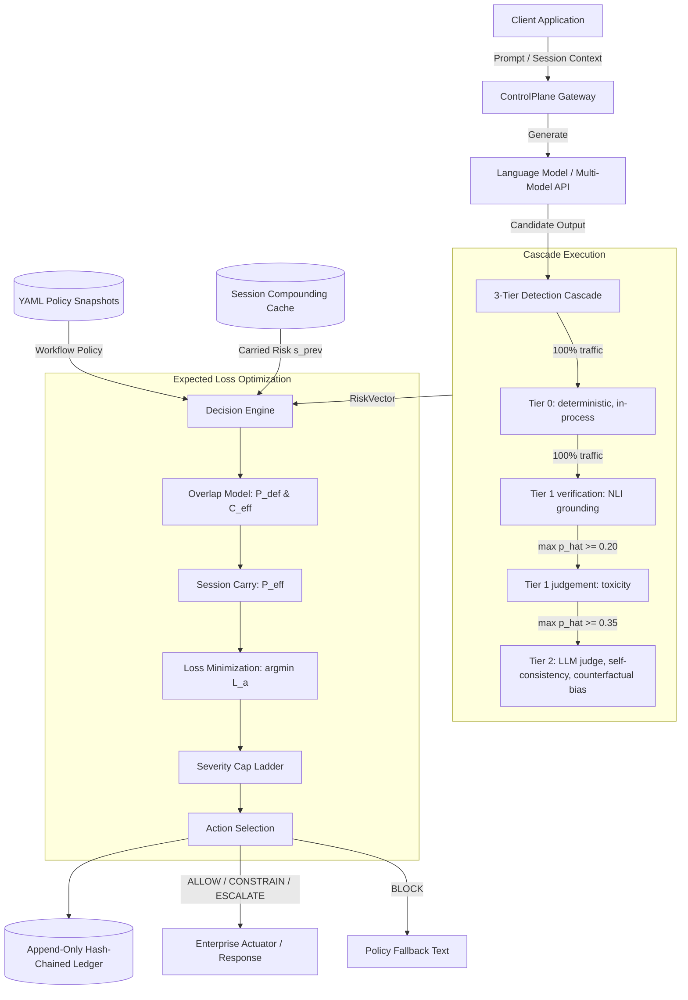
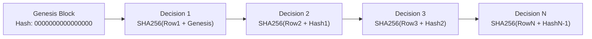

# ControlPlane.ai Technical Architecture Specification

This document details the engineering architecture, mathematical formalisms, data structures, and runtime design of the ControlPlane intervention layer.

---

## 1. System Topology & Data Flow

ControlPlane operates as an inline adjudication gateway between generative model completions and enterprise actuators (users, downstream APIs, or database writes).

### 1.1 Routing

Grounding is **verification** and runs on every request. Gating it behind a
tier 0 score means only claims that already look suspicious are ever checked
against a source, which is backwards, and it removes the system's ability to
notice that it cannot verify something at all. Grounding is also the abstention
entry point, so gating it would silence the mechanism the design depends on.

Only *judgement* detectors are gated: tier 1 toxicity at a max tier 0 score of
0.20, tier 2 at 0.35. Tier 2 additionally requires accumulated latency to be
under 80% of the workflow's budget.

> **Not implemented.** The policy `routing: {q1, q2}` fields describe target
> *fractions of traffic*, not scores. Using them directly as score gates
> inverts their meaning: `q2 = 0.015` as a score gate would fire tier 2 on
> nearly everything. Mapping a target fire rate onto a score quantile needs a
> calibration pass that does not exist yet, so `q1` and `q2` are currently
> declared but unused. Do not present them as active routing.

---

## 2. Decision Arithmetic

The decision engine determines the action $a \in \mathcal{A} = \{\text{ALLOW}, \text{HOLD}, \text{CONSTRAIN}, \text{ESCALATE}, \text{BLOCK}\}$ that minimizes expected enterprise loss, subject to detector precision constraints.

### 2.1 Joint Defect Probability ($P_{\text{def}}$)

Risk tags are non-disjoint. When multiple tags fire on the same completion (for example, a fabricated financial figure that is both a hallucination and a privacy breach), the joint probability of at least one defect is aggregated using pairwise coupling coefficients $\kappa(m, d) \in [0, 1]$:

$$m = \arg\max_{t} \hat{p}_t$$

$$P_{\text{def}} = \hat{p}_m + (1 - \hat{p}_m) \left[ 1 - \prod_{d \neq m} \left( 1 - \kappa(m, d) \cdot \hat{p}_d \right) \right]$$

- When all $\kappa = 0$: $P_{\text{def}} = \hat{p}_m$ (perfect correlation / redundant tags).
- When all $\kappa = 1$: $P_{\text{def}} = 1 - \prod_d (1 - \hat{p}_d)$ (complete statistical independence).

### 2.2 Effective Consequence ($C_{\text{eff}}$)

Total financial liability combines the maximum consequence tag with discounted secondary tags via a joint discount factor $\lambda \in [0, 1]$:

$$C_{\text{eff}} = C_m + \lambda \sum_{d \neq m, \, \hat{p}_d > \tau} C_d$$

where $\tau = 0.05$ prevents noise-level detections from inflating consequence.

### 2.3 Multi-Turn Risk Compounding ($P_{\text{eff}}$)

Risk is not stateless. An unchecked or low-level ambiguity allowed in Turn 1 contaminates the context window for downstream turns. The carried session state $s_t$ compounds across turns:

$$P_{\text{eff}} = 1 - (1 - P_{\text{def}, t}) (1 - \beta \cdot s_{t-1})$$

$$s_t = 1 - (1 - \gamma \cdot s_{t-1}) (1 - \rho(a) \cdot P_{\text{eff}})$$

Parameters:
- $\gamma = 0.85$ (memory decay per turn)
- $\beta = 0.50$ (risk coupling into current turn)
- $\rho(a)$ is the action residual risk ($1.0$ for ALLOW, $0.5$ for HOLD, $0.3$ for CONSTRAIN, $0.1$ for ESCALATE, $0.0$ for BLOCK).

### 2.4 Expected Loss Minimization

For each candidate action $a$, the expected loss $L(a)$ is evaluated:

$$L(a) = \underbrace{\rho(a) \cdot P_{\text{eff}} \cdot C_{\text{eff}} \cdot \iota}_{\text{Unmitigated Liability}} + \underbrace{F(a)}_{\text{Intervention Friction}} + \underbrace{(1 - P_{\text{eff}}) \cdot U(a)}_{\text{False-Alarm Utility Loss}}$$

where:
- $\iota \in (0, 1]$ is the action irreversibility parameter.
- $F(a)$ is the operational cost of intervention (for example, INR 120 for human escalation).
- $U(a)$ is the loss in system utility when an intervention disrupts a benign generation.

The unconstrained optimal action is:

$$a_{\text{unconstrained}} = \arg\min_{a \in \mathcal{A}} L(a)$$

Ties resolve to the lower severity action.

#### 2.4.1 Escalation must cost less utility than a block

The original A6 table set $U(\text{ESCALATE}) = U(\text{BLOCK}) = 200$. With
$F_b = 50 < F_e = 120$ that makes

$$L(\text{ESCALATE}) - L(\text{BLOCK}) = 0.1 \cdot P_{\text{eff}} \cdot C_{\text{eff}} \cdot \iota + 70 > 0$$

for every $p$ and every workflow. BLOCK dominates ESCALATE unconditionally, the
argmin can never select it, and the published five-action spectrum is really
four with no route to a human. A seeded run of 3,011 decisions contained zero
escalations.

Escalation *delays* a response pending review; a block *destroys* it and the
user gets a fallback. The utility loss of a delay is a fraction of the utility
loss of a drop, so $U(\text{ESCALATE}) = 40$ (assumption `A6a`).
`tests/test_action_spectrum.py` asserts that no action in the published
spectrum is dominated across all workflows.

### 2.5 Action Bands

The switching points below are derived from the same $L(a)$ the engine
minimises, by `engine/thresholds.action_thresholds`, so the table and the engine
cannot disagree. Every $L(a)$ is linear in $p$, so the argmin is the lower
envelope of five lines and each switching point is computed exactly as a
pairwise crossing rather than found by sweeping.

| Workflow | first HOLD | first CONSTRAIN | first ESCALATE | first BLOCK |
| :--- | ---: | ---: | ---: | ---: |
| `decision_support` | 0.0011 | never | 0.0075 | 0.0193 |
| `support_chatbot` | 0.0272 | 0.1667 | 0.2031 | 0.2647 |
| `internal_copilot` | 0.2500 | 0.7609 | never | 0.9226 |

`internal_copilot` never escalates at any $p$: a 120-unit human review does not
pay against an 800-unit consequence discounted by $\iota = 0.2$, so it
constrains instead. That is the consequence model working, not a gap.

> **The annex closed forms do not predict engine behaviour.**
> $p^*_{esc} = H / (a_h C)$ and $p^*_{block} = (F_b + U)/(C + U)$ omit both
> $\iota$ and the $(1 - P_{\text{eff}}) \cdot U(a)$ term. For `support_chatbot`
> the closed form puts the block point at 0.078 where the engine actually
> blocks at 0.265. They are retained in `thresholds.py` as annex reference only
> and must not be quoted as operating points.

### 2.6 Agentic Consequence by Reachability

An agent step is adjudicated at the consequence of what it can cause, not what
it says. When a request declares a tool graph:

$$C_{\text{eff}}(\text{step}) = \max_{\text{reachable terminals}} C(\text{tool}) \cdot P(\text{reach}) \cdot \iota(\text{tool})$$

This **overrides** the policy consequence for that step. A copilot reasoning
step that would otherwise be ALLOW at $C_{\text{eff}} = 800$ becomes BLOCK at
$C_{\text{eff}} = 150{,}000$ once it can reach a refund API. Reason codes
`REACHABILITY_CONSEQUENCE` and `REACHABLE_TOOL_DOMINATES` record it.

---

## 3. Precision-Bounded Severity Ladder

An expected loss formula will aggressively choose BLOCK if consequence $C_{\text{eff}}$ is large, even when detector certainty is low. ControlPlane enforces that action severity cannot exceed the empirical precision of the detector:

| Measured Precision ($Pr$) | Maximum Permitted Action | Applied Cap Reason |
| :--- | :--- | :--- |
| $\text{Verifiable} = \text{False}$ | **CONSTRAIN** | `unverifiable` |
| $Pr \ge 0.95$ | **BLOCK** | `None` (Full spectrum permitted) |
| $0.70 \le Pr < 0.95$ | **ESCALATE** | `low_precision` |
| $0.40 \le Pr < 0.70$ | **CONSTRAIN** | `low_precision` |
| $Pr < 0.40$ | **HOLD** (Log and soft review) | `low_precision` |

Final action is computed as:

$$\text{Action} = \min(a_{\text{unconstrained}}, \, \text{SeverityCap})$$

---

## 4. The Abstention Path

When candidate outputs make factual assertions without external retrieval context ($\text{retrieval\_context} = \text{None}$), NLI grounding detectors cannot verify the claim against ground truth.

Instead of silently passing or defaulting to zero probability, the engine:
1. Emits $\text{verifiable} = \text{False}$.
2. Substitutes the shadow-mode empirical prior $\pi_w[\text{tag}]$ from policy configuration.
3. Automatically applies the `unverifiable` cap (maximum action = CONSTRAIN).
4. Appends machine-readable audit reason codes: `ABSTAIN_<TAG>` and `CAP_UNVERIFIABLE`.

This ensures high-consequence workflows (like clinical decision support) escalate or constrain on unverified claims, while low-consequence copilot workflows continue smoothly, with no hardcoded workflow branching in application code.

---

### 4.5 Detector Inventory

State this plainly, because a reviewer will ask which half is real.

| Detector | Tier | Tag | Implementation | Precision |
| :--- | :---: | :--- | :--- | ---: |
| `PIIDetector` | 0 | responsibility | real: regex + Luhn + PAN + Aadhaar | 0.97 checksum / 0.72 regex |
| `SchemaDetector` | 0 | performance | real: JSON contract validation | 0.99 |
| `PolicyListDetector` | 0 | responsibility | real: deny-list match | 0.95 |
| `TokenAnomalyDetector` | 0 | cost | real: rolling EWMA z-score | 0.85 |
| `ProtectedAttributeDetector` | 0 | responsibility | real: attribute/decision proximity | 0.71 |
| `GroundingDetector` | 1 | performance | **real model**, NLI cross-encoder | 0.82 (0.65 lexical fallback) |
| `ToxicityDetector` | 1 | responsibility | simulated, dial-controlled | dial |
| `SelfConsistencyDetector` | 2 | performance | simulated, dial-controlled | dial |
| `LLMJudgeDetector` | 2 | performance | simulated, dial-controlled | dial |
| `CounterfactualBiasDetector` | 2 | responsibility | **real**, needs a model provider | 0.88 |

Every simulated component is labelled as simulated in the UI. The tier 1 and 2
judgement detectors are dialled rather than trained deliberately: the thesis is
about decision arithmetic, and a detector whose TPR and FPR are known quantities
is what makes the threshold study measurable at all.

### 4.6 Grounding

`GroundingDetector` splits the response into claims and runs natural language
inference against the retrieved source, passage by passage, taking the best
supporting and the most refuting match per claim. Three outcomes, and the
distinction is preserved through to the ledger:

| Verdict | Meaning | Weight |
| :--- | :--- | :--- |
| `entailed` | The source supports the claim | counts as supported |
| `contradicted` | The source **refutes** it | raises the floor on $\hat{p}$ for the whole response |
| `unsupported` | The source is silent | counts as ungrounded |

A refuted claim and an unmentioned one are weighted differently, at 1.0 and
0.35, and the score is raised to at least $0.5 + 0.5 \cdot (\text{contradicted} / n)$
when any claim is refuted. One clearly refuted claim is not a small problem
because the other nine sentences happened to check out.

Three properties of the scoring exist because the naive version was wrong, and
each was found by running a live model against it rather than by reasoning.

**Refutation is read only from a relevant passage.** Taking the maximum
contradiction across every passage manufactures one on any long document. The
claim "a refund is processed within five working days" scored 0.827
contradiction against "orders may be refunded within 30 days of delivery", two
sentences about different things that merely disagree numerically. Contradiction
is now read from the passage with the highest content-word overlap with the
claim, and only when that overlap clears a floor.

**Neutral is not treated as refuted.** Strict entailment marks any sentence
adding detail beyond the source as neutral, including ordinary helpful
elaboration. "A refund is processed within five working days after it is
approved" is neutral against a source that never mentions approval, though
nothing in it is wrong. Weighting neutral like refutation made every correct
answer read as fully defective.

**The request is premise material.** A correct answer routinely restates a fact
the user supplied and combines it with the source. Checked against policy
passages alone, "the purchase was 40 days ago, which exceeds the 30 day window"
reads as unsupported because the document never mentions this customer. Adding
the question as premise raised entailment on that claim from 0.012 to 0.467.

#### Known limits

Measured against a live model, not assumed. This detector reliably catches
fabricated specifics, invented timeframes, and invented entitlements. It is
unreliable on three things:

- **Arithmetic and temporal reasoning.** It cannot conclude that 40 days exceeds
  a 30 day window, and it scored "yes, they are eligible" as entailed by a
  policy that in fact excludes that customer.
- **Negation.** "Refunds are issued only to the original payment method, not as
  store credit" reads as contradicting a source that states exactly the first
  half of it.
- **Elaboration.** Any detail beyond the source is neutral by construction, so a
  helpful answer scores lower than a terse one.

This is why grounding carries a measured precision of 0.82 rather than something
higher, and why the severity ladder lets it demand a human but never silence the
model on its own. A larger entailment model would move these numbers. The
architecture around it would not change, which is the point: detector quality is
an input to this system, not its thesis.

The evidence names the offending sentence. A score alone tells a reviewer that
something is wrong somewhere in a paragraph, which is not actionable.

### 4.7 Bias Detection

The brief names bias first, and separately notes that enterprises consume
foundation models through an API rather than owning them, which puts weights,
activations and training data out of reach. Every representation-level fairness
method assumes access this deployment does not have, so both detectors work from
the outside.

**Protected attribute conditioning** (tier 0, deterministic). Flags a decision
made in close proximity to a protected attribute. Categories follow the Indian
constitutional grounds, Articles 15 and 16, plus the usual lending and employment
grounds, because the shipped policies declare `jurisdiction: IN`. Caste and
religion matter here in a way a US or EU list would miss entirely.

Two false-positive sources are handled explicitly:

- **Negated mentions are suppressed.** "We never consider religion when we
  approve an application" describes a safeguard, not a bias. Flagging it trains
  reviewers to ignore the detector.
- **Bare pronouns are excluded** from the gender vocabulary. `he` and `she`
  appear in almost any sentence about a person, so including them flags every
  ordinary decision written about a named individual.

Precision is 0.71, which by the severity ladder means this detector can demand a
human but can never silence the model on its own. That is deliberate:
co-occurrence is suggestive, not proof.

**Counterfactual invariance** (tier 2). Asks whether the model would have
answered differently had the protected attribute changed and nothing else. The
request is rewritten swapping the attribute *within its category*, so only one
variable moves; the variants are regenerated and compared by embedding cosine
distance, so harmless rewording does not register while a reversed
recommendation does. This is counterfactual fairness made operational, and it is
measurable through an API because it needs only the ability to prompt and
compare.

It costs one model call per variant, so it sits behind the tier 2 gate. With no
provider and no supplied variants it **abstains**: a fairness check that could
not run has not found the system fair.

---

---

## 5. Cryptographic Ledger Design

Every adjudication (including clean ALLOW passthroughs) writes an immutable record to SQLite in WAL mode.

### 5.1 Ledger Schema
- `decision_id`: UUIDv4
- `request_id`: Tracing correlation identifier
- `session_id`: Multi-turn state tracking identifier
- `workflow_id`: Policy identifier (`internal_copilot`, `support_chatbot`, `decision_support`)
- `policy_version`: Policy revision tag
- `action`: Final adjudicated action
- `p_def`: Raw joint defect probability
- `p_def_effective`: Effective probability with session carry
- `c_eff`: Effective financial consequence (INR)
- `losses_json`: JSON map of $L(a)$ for all 5 actions
- `unconstrained_action`: Minimum loss action prior to precision bounding
- `severity_cap`: Applied severity cap
- `cap_reason`: Reason for capping
- `reason_codes_json`: Machine-readable audit code array
- `risk_vector_json`: Complete detector outputs with evidence spans and latencies
- `session_risk_before` / `session_risk_after`: Compounding state values
- `total_latency_ms`: Combined end-to-end adjudication overhead
- `timestamp`: ISO-8601 UTC timestamp
- `prev_hash`: SHA-256 digest of previous ledger row
- `row_hash`: SHA-256 digest of current payload + `prev_hash`

---

### 5.2 Integrity Guarantees

`Ledger.verify_chain()` returns `(valid, rows_checked)` and checks **two** things
per row:

1. **The link.** `prev_hash` equals the previous row's `row_hash`.
2. **The content.** `row_hash` recomputes from the row's own stored fields,
   through the same canonical serialiser `append()` used.

Check 2 is the one that catches an edited decision. Verifying only the links
proves the rows are in the order they were written, not that any of them still
says what it said: rewriting an action from BLOCK to ALLOW leaves every link
intact. Every field an auditor would care about is inside the hashed payload, and
`tests/test_ledger.py` tampers with each hashed column individually rather than
trusting the list.

On failure `rows_checked` is the index of the first bad row.

**Concurrency.** The previous hash is read *inside* a `BEGIN IMMEDIATE`
transaction, not taken from memory. Two writers on the same database file each
hold their own idea of the chain head, and if both trust it they write rows
claiming the same predecessor and break verification for everyone. The write
lock is taken before the read, so the value cannot change in between. A
process-local mutex serialises threads within one process.

### 5.3 Human Adjudication

Verdicts live in a separate `labels` table, keyed by `decision_id`. A decision
row is append-only and hash-chained, so a label must never modify the record it
refers to; if labels were columns on the decision, writing one would invalidate
every hash after it.

`POST /v1/decisions/{id}/adjudicate` is the feedback loop's only entry point,
and the sole source of EDR, UIR, override rate and calibration.
`python -m sim.seed_data` writes a 20% **random** audit sample so a fresh install
has something to read. The sample is random rather than "everything we flagged",
because labelling only interventions leaves escaped defects permanently
invisible and biases the calibration fit toward the flagged tail.

---

### 5.4 Calibration and the Enforcing Gate

The decision arithmetic is only as trustworthy as the probabilities fed into it.
A policy may not move from `advisory` to `enforcing` until ECE is under 0.05.

`GET /v1/calibration` scores raw $P_{\text{def}}$ against human verdicts and
reports ECE, Brier, and what an isotonic fit would reduce them to. On the seeded
ledger:

| Metric | Whole set (`/v1/calibration`) | Held out (`/demo/screen5`) |
| :--- | ---: | ---: |
| ECE, as reported | 0.0733 | 0.0726 |
| ECE, after isotonic | 0.000 | 0.0005 |
| Brier, as reported | 0.0283 | 0.0249 |
| Base rate | 0.013 | 0.013 |
| Mean reported probability | 0.0864 | 0.0726 |
| Passes enforcing gate | **no** | **no** |

Two columns because they answer different questions. `/v1/calibration` scores
the whole labelled set, so its post-isotonic ECE is near zero by construction
and is a diagnostic only. `/demo/screen5` fits on a training split and scores on
data the map has never seen, which is the number worth quoting.

The detector reports a mean probability around 5.6 times the true base rate.
Under a ₹50,000 consequence that overconfidence is enough to hold traffic that
should pass, which is exactly what the unnecessary intervention rate shows. The
gate is doing its job by refusing to let this policy enforce.

Below 50 labels the endpoint declines to estimate rather than returning a number
it cannot support.

#### 5.4.1 Applying the correction

`POST /admin/calibration/fit` fits the map and activates it. While active,
`decide()` corrects `P_def` immediately after the overlap model and before the
loss arithmetic, and records the `CALIBRATED` reason code.

Fitting is always on a training split and scoring always on a held-out split.
Isotonic regression evaluated on its own training data reports an error near
zero by construction and means nothing.

The thresholds are deliberately untouched. It is tempting to fix an
over-intervening system by raising its thresholds, but the thresholds are
derived from the consequence model, and moving them by hand discards exactly the
property that makes them defensible. The probability was wrong, so the
probability is what gets corrected.

Measured on the seeded ledger, 614 adjudicated decisions split 430 train and 184
held out, correcting the probability takes held-out ECE from 0.0726 to 0.0005
and removes about 98% of unnecessary interventions, 4,805 to 114 per 10,000, at
the cost of one escaped defect.
That trade is shown on the screen rather than hidden: the consequence model is
what says which of the two costs more.

Reading `/demo/screen5` fits a scratch instance and does not activate anything.
Inspecting a diagnostic must not change what the live engine is doing.

---

## 6. Assumptions Mapping

All economic and operational constants correspond to assumption identifiers in the Round 2 Technical Annex:

| Code | Parameter | Value | Rationale |
| :--- | :--- | :--- | :--- |
| `A1` | Total Monthly Volume | 130,000 interactions | 70k support, 45k copilot, 15k decision support |
| `A2` | Defect Base Rates $\pi_w$ | 2.5%, 3.0%, 1.5% | Loosely governed copilot vs strict decision support |
| `A3` | Action Conversion Rates | 40%, 25%, 60% | Decision support outputs exist specifically to be acted on |
| `A4` | Consequence per Defect $C_w$ | INR 3,000 / 800 / 50,000 | Support credit vs internal rework vs regulatory remediation |
| `A5` | Post-hoc Review Catch Rate | 8.0% | Typical upper limit for sampled human review |
| `A6` | Intervention Cost Parameters | $U=200, F_b=50, H=120$ | Utility loss, blocking friction, human escalation cost |
| `A6a` | Escalation Utility Loss | $U_e = 40$ | Review delays a response, a block destroys it. At $U_e = U$ the argmin can never route to a human. See 2.4.1 |
| `A8` | Pairwise Coupling $\kappa$ | 0.4 (perf/resp), 0.9 (cost pairs) | Fabricated claims overlap with responsibility risks |
| `A9` | Joint Discount $\lambda$ | 0.30 | Secondary defect impact discount |
| `A10` | Session Memory Decay $\gamma$ | 0.85 | Carried risk decay rate per dialogue turn |
| `A11` | Session Risk Coupling $\beta$ | 0.50 | Context contamination blend rate |
| `A12` | Action Irreversibility $\iota$ | 0.2 (copilot), 0.6 (support), 0.9 (decision) | Automated claims cannot easily be un-executed |
| `A13` | Detector Precision Hierarchy | 0.97 (PII/Luhn) down to 0.72 (Regex) | Precision-dependent severity capping |

---

## 7. Failure Modes and Reliability

The governing rule is **fail loudly in the engine, gracefully at the edges**. An
invalid configuration must never reach a decision, and a detector that cannot
run must never be mistaken for one that found nothing.

### 7.1 Implemented

**Policy loading.** Invalid YAML, out-of-range probabilities, missing action
keys, or a non-monotonic residual vector raise `PolicyError` at load time.
`api.py` loads policies at import, so an invalid policy prevents the server
starting rather than surfacing at decision time.

**Detector unavailability.** A detector that cannot run returns
`verifiable=False` rather than `p_hat=0.0`. The engine substitutes the
workflow's prior (never zero), records `ABSTAIN_<TAG>`, and caps severity at
`CONSTRAIN`. This covers all of: no retrieval context, NLI model unavailable,
counterfactual variants ungeneratable, and LLM judge parse failure.

**Detectors are warmed at startup.** The entailment model is loaded on the
startup event rather than on first use. Lazy loading meant the first
adjudication after a cold start raced the load, silently took the lexical
fallback, and returned a different verdict from every request after it. On one
observed input that was CONSTRAIN against ESCALATE. Warming costs a few seconds
of startup once, and a load failure is still not fatal.

**Degraded methods declare themselves.** When the NLI model is unavailable,
grounding falls back to lexical overlap, reports
`method: lexical_overlap_fallback`, and carries its own lower precision (0.65
rather than 0.82) so the severity cap does not credit a heuristic with a model's
accuracy.

**Ledger integrity.** Content and link are both verified, and concurrent writers
cannot fork the chain. See 5.2.

**Provider absence.** With no API key, `/demo/live` replays a recorded response
and labels it `source: "recorded"`. A custom typed question returns **503**
rather than being answered from a recording. An empty key reads as unconfigured,
which is a valid setup; a placeholder string would be worse, because the client
would construct and then fail with an auth error at demo time.

**Configuration precedence.** Real environment, then `.env.local`, then `.env`.
Files are loaded in `controlplane/__init__.py` before any module reads
`os.environ`, since `providers.py` and `detectors/nli.py` both resolve their
configuration at import. Loading uses `override=False`, so an export or a test
fixture always beats a file on disk. That is what stops a developer's
`.env.local` from redirecting the test suite at the seeded ledger.

### 7.2 Not implemented

Listed so nobody builds on them or presents them as working.

**Detector timeouts.** There is no per-detector timeout and no
`TIMEOUT_<DETECTOR>` reason code. Tier 2 is skipped when accumulated latency
already exceeds 80% of the workflow budget, which bounds the common case, but a
single detector that hangs will hang the request. The abstention path is the
correct destination for a timeout and already exists; only the timer is missing.

**`fail_mode`.** The `fail_mode: open | closed` field is loaded and validated
but **not consumed by the engine**. There is no exception handler that returns a
generation under soft warning for `open`, or policy fallback text for `closed`.
Today an unhandled engine exception propagates as a 500.

**Policy `routing: {q1, q2}`.** Declared but unused as routing. See 1.1.

**Test isolation, now fixed.** The suite used to run against the same
`controlplane.db` the demo screens read from, so every run grew the audit sample
and tests that deliberately label a benign response as defective corrupted the
calibration data. It was observed inverting the measured effect of calibration.
`tests/conftest.py` now points `CONTROLPLANE_DB` at a throwaway copy.

**Blocking endpoints, now fixed.** Endpoints doing cascade runs, entailment
inference or sim scoring were declared `async def`, so that CPU work ran on the
event loop and blocked every other request for its duration. `/demo/screen2`
took about eleven seconds, during which the dashboard froze and telemetry polls
failed. They are plain `def` now, which FastAPI runs in a threadpool.

**Tier 2 cost accounting.** `SelfConsistencyDetector` is specified to cost $k=5$
generations but is billed as one tier 2 unit, so `estimated_cost_units`
understates tier 2.

**Streaming, authentication, multi-tenancy.** Out of scope by decision, not
oversight. Responses are adjudicated complete; the annex explains the
buffered/gated/monitored modes that streaming would need.

### 7.3 Deliberate Non-Goals

- **Inline rewriting.** `CONSTRAIN` re-prompts with a narrower contract; it never
  edits model output.
- **Representation-level detection.** The brief confirms API-level model
  consumption, so activations and weights are out of reach. This is why bias
  detection is counterfactual rather than representational.
- **Training.** Calibration fits isotonic regression on outputs. Nothing else is
  trained.
